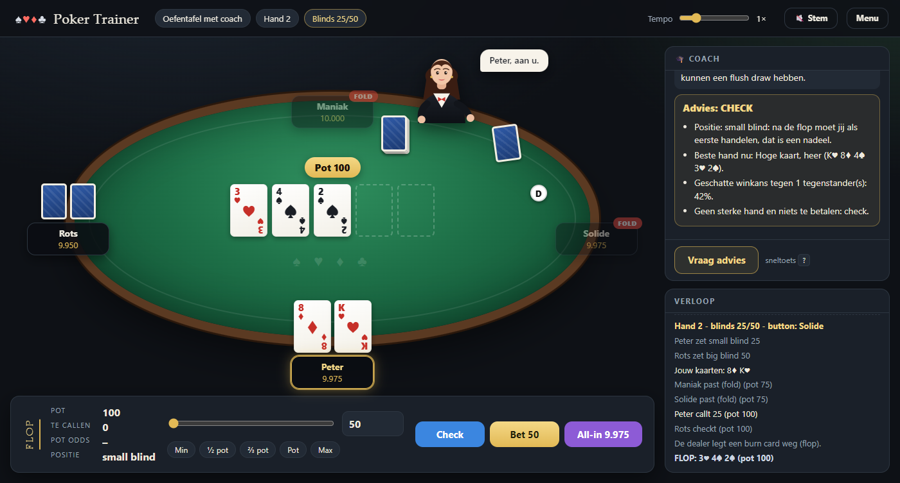

# Poker Trainer

Leer **No-Limit Texas Hold'em** – de variant die op kampioenschappen zoals de
WSOP wordt gespeeld – spelenderwijs in de console of in de browser. Het programma
is geschreven in Python 3.11+ zonder externe afhankelijkheden en is opgebouwd
rond de klassieke Gang-of-Four ontwerppatronen.



## Starten

Console:

```bash
python main.py
```

Browser (opent automatisch `http://127.0.0.1:8765/`; ook zonder externe pakketten):

```bash
python main.py --web
```

Opties: `--port 8080`, `--host 0.0.0.0`, `--no-browser`, `--coach gevorderd`. Alternatief: `python -m pokertrainer.web`.

Tests draaien (pytest):

```bash
python -m pytest
```

## Wat je leert

| Menu | Les | Inhoud |
|------|-----|--------|
| 1 | Handrangschikking | Alle 10 categorieën met voorbeelden, daarna een quiz: "welke hand is dit?" en "wie wint de showdown?" |
| 2 | Regels van toernooipoker | In twaalf delen, vanaf nul: het kaartspel, chips en blinds, verloop van een hand, de acties, inzetregels, zijpotten, showdown, starthanden beoordelen (Chen-formule), verdedigen tegen een raise en push-or-fold, toernooiregels en een woordenlijst. Met quiz. |
| 3 | Oefentafel met coach | 10 handen tegen drie bots met verschillende stijlen. De coach legt bij elke beslissing uit: starthandklasse, draws en outs, winkans, pot odds, positie en een advies. Wie bust is koopt opnieuw in. |
| 4 | Sit-and-go toernooi | Zes spelers, WSOP-achtige blindstructuur met big blind ante vanaf niveau 4. De coach geeft alleen advies als je `?` typt (in de browser: de knop); op gevaren op het board (mogelijke flush, gepaard board) en op top pair of beter wijst hij wel automatisch. |

Aan tafel typ je `f` (fold), `c` (call/check), `k` (check), `r 300` (bet/raise naar 300),
`a` (all-in), `?` (coach), `h` (hulp) of `q` (stoppen).

## Coachmethode: hoe beoordeelt de coach je starthand?

De coach en de bots beoordelen de twee eigen kaarten met een **starthandmodel**
(Strategy-patroon, `starting_hands.py`). Er zijn er twee, te kiezen met
`--coach`, in het consolemenu of op het startscherm van de browser:

| Methode | Wat ze doet | Voor wie |
|---|---|---|
| `beginner` (standaard) | **Chen-formule**: hoogste kaart, paar, suited en het gat ertussen opgeteld; de coach toont de berekening ("hoogste kaart heer 8, gat van 7 kaarten -5 = 3"). | Leren waarom een hand sterk of zwak is. |
| `gevorderd` | **Rangetabel per positie** (6-max, raise first in): een vaste lijst handen per positie, van krap onder de gun (± 13 %) tot ruim op de button (± 43 %). De coach zegt vanaf welke positie een hand speelbaar is. | Zoals spelers het in de praktijk leren. |

Beide modellen vertalen hun oordeel naar dezelfde schaal (premium / een raise
waard / speelbaar / fold), zodat de bots met elke methode dezelfde speelstijl
houden. In deel 9 van de regelles kun je in de browser een hand, positie en
situatie invoeren en de oordelen naast elkaar zien.

Twee situaties krijgen een eigen behandeling:

- **Tegen een raise** (`defend`). De rangetabel kent een 3-bet-range (TT+, AQs+,
  AKo) en drie call-ranges: in positie (± 14 %), buiten positie (± 8 %) en de
  big blind, die dankzij de al betaalde blind ruim verdedigt (± 48 %). De
  Chen-methode eist om een raise te callen één à twee punten meer dan om te
  openen (voor de coach 9 in plaats van 8; hoe losser de speler, hoe groter het
  verschil), 11 punten om te re-raisen, en geeft in de big blind 2 bonuspunten.
- **Korte stack** (`push_fold.py`, tot en met ± 12 big blinds inclusief je al
  geplaatste blind, voor beide methodes). Een push-or-fold-tabel naar de heads-up
  Nash-tabel: per hand tot hoeveel big blinds je all-in gaat; hoe meer
  tegenstanders je all-in nog kunnen callen, hoe minder handen. Over een raise
  van een grotere stack ga je er all-in overheen (re-shove) of je past; een
  all-in callen vraagt de sterkste hand.

De coach noemt bij elke beslissing de regel die hij toepast én waarom
(positie, prijs van de call, initiatief van de raiser, stackgrootte).

## Browserversie

Dezelfde vier lessen en exact dezelfde spelmotor, maar dan met een grafische
pokertafel: stoelen rond het laken, kaarten, chips, dealerbutton, pot, een
actiebalk met raise-slider en potpresets, een coachpaneel en een logboek.
De quizlessen tonen echte kaarten en geven meteen feedback; de regels staan
als bladzijden met een quiz erachter.

- Knoppen of sneltoetsen: `F` fold, `C` call/check, `K` check, `R` raise (bedrag
  van de slider), `A` all-in, `?` coach.
- Een gestileerde croupier deelt de kaarten: kaartruggen vliegen van haar hand naar elke stoel
  (twee rondes, zoals aan een echte tafel), naar het board en naar de burn-stapel; fiches schuiven
  na elke hand naar de winnaar. Wie `prefers-reduced-motion` aan heeft, ziet geen vliegende kaarten.
- De croupier praat mee in een tekstballon: "De flop: 6♠ 5♣ K♥", "Jij, aan u", "375 voor Rots",
  nieuwe blindniveaus, uitschakelingen en de winnaar. Met de knop **Stem** in de bovenbalk spreekt ze
  die zinnen ook hardop uit (spraaksynthese van de browser, Nederlandse stem indien aanwezig; standaard uit).
- Het speltempo is instelbaar met de schuif in de bovenbalk (0,5× tot 3×): bedenktijd van de bots,
  pauzes na het delen, de showdown en de potuitkering, en de animaties.
- Deeplink: `http://127.0.0.1:8765/?les=oefenen&naam=Peter&coach=gevorderd` start meteen een les
  (`rangschikking`, `regels`, `oefenen` of `toernooi`).
- Aan de oefentafel adviseert de coach automatisch; in het toernooi alleen op verzoek. De knop
  "Vraag advies" werkt alleen zolang jij aan de beurt bent. Adviseert de coach een bet of raise,
  dan springen slider en knop naar dat bedrag (preset "Coach").

De browserlaag (`pokertrainer/web/`) gebruikt alleen de standaardbibliotheek:
`http.server` levert de pagina en een kleine JSON-API, en het spelverloop komt
binnen via Server-Sent Events. De spelmotor draait per tafel in een
achtergrondthread; de mens antwoordt via een postvak (`queue.Queue`).

## Officiële regels die de motor afdwingt

- Blinds, dealerbutton die doorschuift, kaarten één voor één gedeeld, burn cards (de motor
  publiceert daarvoor een `CardBurned`-gebeurtenis).
- Een raise is minstens zo groot als de vorige bet of raise in dezelfde straat.
- Een all-in die kleiner is dan een volledige raise heropent de actie **niet**
  voor spelers die al gehandeld hebben (zij mogen alleen callen of folden).
- Big blind heeft preflop de optie; postflop begint de actie links van de button.
- Heads-up: de button is small blind, handelt preflop eerst en postflop laatst.
- Hoofdpot en zijpotten op basis van wat iedereen in totaal inzette; ongecald
  bedrag gaat terug; oneven chip naar de eerste speler links van de button.
- Showdown: de laatste agressor toont als eerste.
- Toernooi: stijgende blindniveaus, big blind ante, uitschakeling en rangschikking.

## Architectuur en patronen

```
main.py                      startpunt
pokertrainer/
  app.py         Facade          PokerTrainer: menu en samenstelling van alle onderdelen
  lessons.py     Template Method Lesson.run = intro → oefening → samenvatting
                 Factory Method  LessonFactory
  cards.py       Flyweight       52 gedeelde Card-instanties (Card.of), Deck als Iterator
  evaluation.py  Chain of Resp.  StraightFlushDetector → FourOfAKind → … → HighCard
  events.py      Observer        EventBus; ConsoleView, Coach en SessionStats abonneren zich
  actions.py     Command         Fold/Check/Call/Raise/AllIn-commando's + CommandFactory
  strategies.py  Strategy        HeuristicBotStrategy, HumanConsoleStrategy, ScriptedStrategy
  players.py                     Player: chips, kaarten en toestand binnen een hand
  table.py                       Table: stoelen en de dealerbutton
  context.py                     DecisionContext: wat een speler weet als hij beslist (pot odds, positie, stack)
  starting_hands.py Strategy     StartingHandModel: ChenModel (beginner) en RangeChartModel (gevorderd), incl. verdedigen
  push_fold.py                   NashPushFold: push-or-fold voor korte stacks
  streets.py     State           PreFlop → Flop → Turn → River → Showdown
  tournament.py  Builder         TournamentConfigBuilder, presets (championship_sit_and_go)
  factory.py     Factory Method  PlayerFactory.create_strategy (bot- en mensfabriek)
  betting.py                     BettingRound: de inzetregels
  dealer.py                      HandRunner (één hand) en PotCalculator (zijpotten)
  session.py                     Tournament: reeks handen, niveaus, uitschakelingen
  coach.py                       Coach: uitleg en advies, gebaseerd op dezelfde strategie als de bots
  equity.py                      Monte-Carlo winkans
  view.py                        ConsoleView en SessionStats (observers)
  console.py                     UserIO-abstractie (ConsoleIO, ScriptedIO)
  quiz.py                        Quizvragen (gedeeld door console en browser)
  rules_content.py               De twaalf delen en de quiz van de regelles (gedeeld door console en browser)
  web/
    adapters.py  Adapter         WebIO en WebHumanStrategy: UserIO/DecisionStrategy voor de browser
                 Decorator       PacedStrategy: bedenktijd rond een botstrategie
    presenter.py Observer        TablePresenter: gebeurtenissen → JSON met momentopname van de tafel
    session.py                   WebSession: één tafel in een achtergrondthread, gebeurtenissenlog en postvak
    content.py                   Lesinhoud en quizvragen als JSON
    server.py    Facade          TrainerBackend + HTTP-server (JSON-API, Server-Sent Events, statische bestanden)
    cli.py, __main__.py            Opdrachtregelopties (--host, --port, --no-browser, --coach); python -m pokertrainer.web
    static/                      index.html, style.css, app.js (vanilla JavaScript)
tests/                           pytest: evaluatie, inzetregels, zijpotten, toernooi, starthandmodellen, push-or-fold, browserlaag
```

De spelmotor (dealer, betting, streets) kent geen console: hij publiceert
alleen gebeurtenissen. Daardoor is dezelfde motor bruikbaar voor de
oefentafel, het toernooi en de tests (die met `ScriptedStrategy` werken; de
browsertests draaien een `WebSession` zonder pauzes).

## Bots

| Naam | Stijl |
|------|-------|
| Rots | tight-passief: speelt weinig handen, raiset zelden |
| Maniak | loose-agressief: speelt bijna alles en bet constant |
| Solide | tight-agressief: selectief, maar raiset met goede handen |
| Station | calling station: callt veel, raiset bijna nooit |
| Prof | solide en agressief, let op pot odds |

Alle bots gebruiken dezelfde `HeuristicBotStrategy` met een ander profiel
(`looseness`, `aggression`): preflop op basis van het gekozen starthandmodel
(Chen-formule of rangetabel, zie Coachmethode) en met een korte stack de
push-or-fold-tabel; postflop op basis van geschatte winkans versus pot odds.

## Licentie

MIT, zie [LICENSE](LICENSE).
